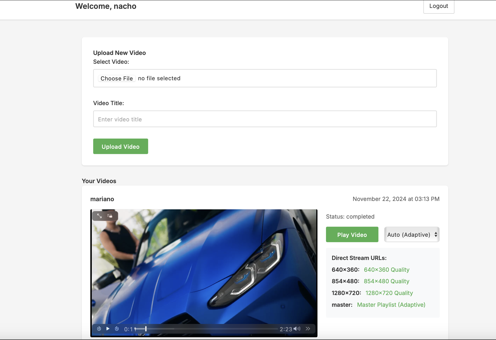

# R2 Video Streaming Service

A Node.js application that processes uploaded videos into HLS streams with multiple resolutions and stores them in Cloudflare R2. Features user authentication and real-time processing status tracking.



## Features

- Simple username authentication
- Video upload handling with multipart form
- FFmpeg processing to create HLS streams
- Multiple resolution support (360p, 480p, 720p)
- Cloudflare R2 storage integration
- Real-time processing status updates
- Video management dashboard
- Persistent video status tracking

## Prerequisites

- Node.js installed
- FFmpeg installed on your system
- Cloudflare R2 account with credentials
- SQLite3

## Installation

1. Clone the repository
2. Install dependencies:
```bash
npm install
```

3. Configure environment variables:
   Copy the `.env.example` file to `.env` and fill in your R2 credentials:
   - R2_ACCOUNT_ID
   - R2_ACCESS_KEY_ID
   - R2_SECRET_ACCESS_KEY
   - R2_BUCKET_NAME
   - R2_PUBLIC_URL

4. Initialize the database:
```bash
node init-db.js
```

## Usage

1. Start the server:
```bash
npm run dev
```

2. Access the application at `http://localhost:3000`

3. Login with any username (will be created if it doesn't exist)

4. Upload videos:
   - Select a video file
   - Add a title
   - Submit and watch the real-time progress

5. View your videos:
   - See all your uploaded videos
   - Track processing progress
   - Access HLS stream URLs for completed videos

## Database Structure

### Users Table
- id: Primary key
- username: Unique username
- created_at: Timestamp

### Videos Table
- id: Primary key
- user_id: Foreign key to users table
- video_id: Unique identifier for the video
- title: Video title
- status: Current status (uploading/processing/completed)
- progress: Processing progress (0-100)
- streams: JSON string containing HLS stream URLs
- created_at: Timestamp

## API Response Example

```json
{
  "message": "Video processed successfully",
  "videoId": "1234567890",
  "streams": [
    {
      "resolution": "640x360",
      "url": "https://your-r2-public-url/videos/1234567890/640x360/playlist.m3u8"
    },
    {
      "resolution": "854x480",
      "url": "https://your-r2-public-url/videos/1234567890/854x480/playlist.m3u8"
    },
    {
      "resolution": "1280x720",
      "url": "https://your-r2-public-url/videos/1234567890/1280x720/playlist.m3u8"
    }
  ]
}
```

## Notes

- Maximum file size is set to 500MB by default
- Supported video formats depend on FFmpeg installation
- Temporary files are automatically cleaned up after processing
- Video processing status persists across browser sessions
- Real-time updates are handled through Socket.IO
